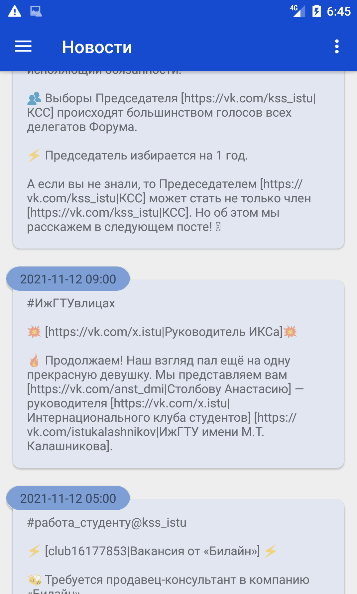
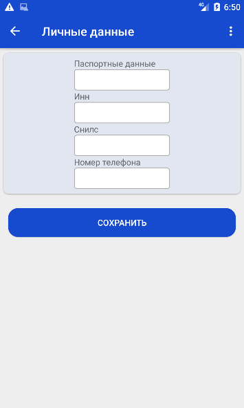
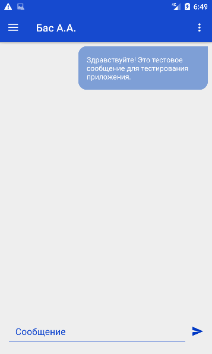
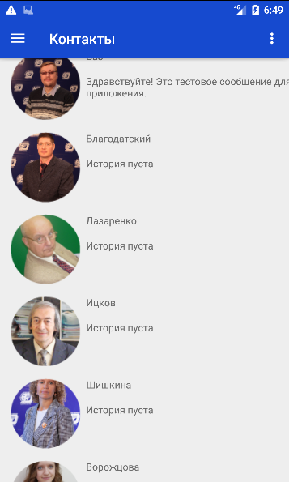

# ISTUstudents
Это первая версия приложения "Личный кабинет студента ИжГТУ".
Цель данной работы продемонстрировать навыки владения технологиями разработки нативных приложений под Android.
К сожалению, сторонний пользователь (Не студент ИжГТУ) не сможет оценить функционал приложения на личном опыте, т.к. регистрация совершается вручную при зачислении студента в ИжГТУ.

Общая задача приложения обеспечить студенту возможности:
1) Получать информацию о новостях и событиях в жизни ВУЗа. За основу, как источник, была взяла официальная группа ВК Координационный Студенческий Совет ИжГТУ.
2) Автоматически сформировать (и возможно отправлять) заявление на материальную помощь в соответствующий деканат. (В стадии разработки)
3) Связаться с профильным преподавателем в рамках системы ИжГТУ. (Перечень преподавателей определяется реализацией бэкэнда сервиса)
4) Своевременно получать оповещения о выходящий постах в ВК в виде Push уведомлений.

Основные технологии, которые задействованы в процессе разработки:
MVVM - элементы View не выполняют вычислений, преобразований и прочих операций, они перенесены во ViewModel.
Retrofit - реализует REST API организующий связь с бэкэндом сервиса.
Coroutine - запросы на сервисы выполняются асинхронно.
Dagger - реализует паттерн DI в проекте. (Закомментирован, т.к. возникла ошибка. В планах разобраться и вернуть)

